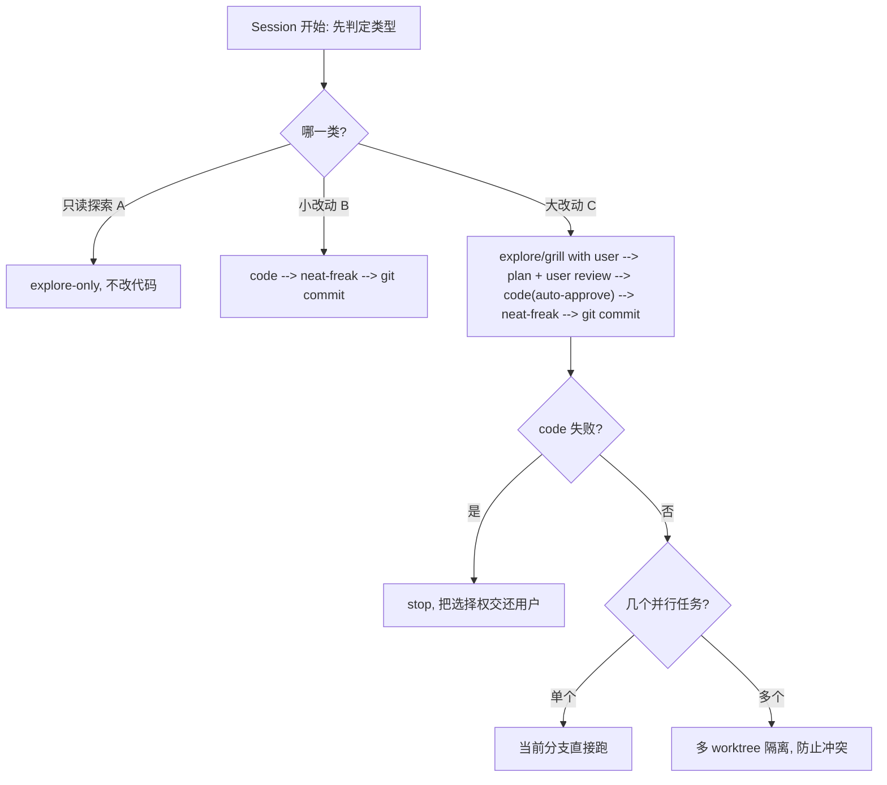

<!--
  这是 init-repo-agents 生成 AGENTS.md 的基线模板。
  使用方式：
  - 用项目事实替换所有 {{PLACEHOLDER}}。
  - 第 0 节「Session 生命周期」是最顶层行为约束，原样保留，不要压缩。
  - 已全局安装的 skill（neat-freak / karpathy-guidelines / modern-python / find-docs·ctx7 / git-commit / gh-cli）按名字引用即可；
    grill 未全局安装，其工作流已内嵌在第 2 节，无需外部依赖。
  - 落地后把本文件同样内容镜像一份到 CLAUDE.md（两份保持逐字一致）。
-->

# {{PROJECT_NAME}} · Agent 协作约定

> {{ONE_LINE_PURPOSE}}

本文件是 agent 在本仓库工作的行为基线。核心信条：**对齐先于动手，协作高于自作主张。** 写代码之前，先和用户把 context 对齐清楚，这是任何编码工作的前置条件。

---

## 0. Session 生命周期（最顶层约束）

**每个 session 开始时，agent 必须先显式判定并声明自己属于哪一类 session**，再按对应生命周期推进。不要跳过这个判定。

- **A 类 · 只读探索**（explore-only）：只读、答疑、调研，不改任何代码。用 explore 方式收集上下文即可，不进入编码流程。
- **B 类 · 小改动**（small code）：改动小、意图清晰、无重大权衡。跳过重量级 grill，直接 `code → neat-freak → git commit`。
- **C 类 · 大改动**（large code）：改动大 / 涉及架构 / 存在权衡。走完整生命周期，并选择分支策略。

**判定信号（C 类）**：触及不可逆 / 破坏性操作、架构级决策、需要拆成多个子任务 —— 归为 C 类，先对齐再动手。拿不准就按 C 类处理。

**C 类失败处理**：`code` 阶段虽可自动推进（auto-approve），但一旦反复失败或不确定意图，立即 stop，把选择权交还用户，不要赌一把继续往下写（见第 3 节）。

---

## 1. 时机 · 什么时候做什么

- **会话开始时**：先确认这是新任务还是续接旧任务。续接时，先读 `docs/plan.md`、`docs/log.md`，恢复上次的进度和思路，不要凭空重来。
- **任务启动前（写任何代码之前）**：进入对齐阶段，用第 2 节的 grill 流程和用户交互，确认双方 context 对齐，确保 agent 的决策路径符合用户要求。
- **一个阶段做完 / 里程碑达成时**：跑一次 `neat-freak`，把代码、文档（`docs/`、`README.md`）、记忆做一次洁癖级同步，避免知识腐烂。
- **每完成一个任务**：在 `docs/log.md` 顶部追加一条记录（最新在最上）。

## 2. 对齐 · 写代码的前置条件（内嵌 grill 流程）

这是最看重的一条。**不允许在用户表达不清的情况下，带着自己的猜想和侥幸去隐瞒用户、直接动手。** 大改动（C 类）动手前，按 Grill → Distill → Execute 三阶段推进，前两阶段没走完不要开始执行。

**Grill（拷问对齐）**
- 顺着决策树一次问一个问题，等回答后再问下一个。
- 每个问题给出推荐答案 + 一句话理由，降低用户决策成本。
- 能通过读代码 / 查文档自己回答的问题，就自己去查，不要拿来问用户。
- 遇到模糊或重载的术语，先提议一个唯一的规范命名，再继续（"你说的 'env' 是 conda 环境还是仿真环境？选一个"）。
- 关系或边界模糊时，用具体场景逼出精确边界。
- 用户陈述"某处怎么工作"时，和代码交叉验证；发现矛盾立刻指出。

**Distill（沉淀决策）**
- 讨论收敛后，把耐用产物写进本文件，然后停下让用户确认再继续。只沉淀两类：
  - **Glossary（术语表）**：我们定为规范的术语，`术语 — 定义`，不含实现细节。
  - **Decisions（决策）**：难以逆转的选择，`选择 · 备选 · 理由`。
- 一条决策只有在「难以逆转、脱离上下文会意外、且是真实权衡的结果」三者都满足时才记录，缺一则跳过。

**Execute（执行）**
- 到这一步才写计划并开始实现，遵循刚沉淀的决策。

遵循 `karpathy-guidelines`：做最小、最外科手术式的改动；不过度设计；显式说明假设；定义可验证的成功标准。

## 3. 异常 · 学会打断自己

当感觉当前上下文不足以做出正确判断时，**主动终止，把选择权交还给用户**，而不是赌一把继续往下写。

判断"卡住了"的信号：同一个失败动作重复尝试、不确定用户真实意图、改动会触及不可逆/破坏性操作、多次尝试无进展。

## 4. 协作 · 一个问题不能直接解决时的找上下文路径

记住自己是大模型，对特定代码库的细节并不天然了解。不能直接解决时，按下面的顺序去**找足够相关的上下文，而不是靠猜**：

1. **查文档细节** → 用 `ctx7` / `find-docs` 查特定库、框架、API 的当前文档（即使是熟悉的库也查，训练数据可能过时）。
2. **奇怪的 bug** → 联网搜索；用 `gh`（`gh-cli`）去对应仓库的 issue 区看大家遇到的相同情况。
3. **仍不清楚** → 向用户询问更多上下文，或直接打断自己让用户提供决策想法。

目标是把决策建立在证据而非猜测上。

## 5. 文档 · docs/ 是 Agent 和用户共同扩展的项目上下文

不要过分依赖 git history，要把可读的项目上下文沉淀进 `docs/`，方便下次开工快速恢复，也方便跨设备 / 跨 agent 迁移（不依赖某个 CLI 的全局 memory）。必须维护：

- `docs/plan.md` —— 用户和 agent 一起看的当前计划，防止下次开工忘了上次想到哪。
- `docs/log.md` —— 已完成任务记录，**最新的在最上面**。
- `docs/bug.md` —— 沉淀各种奇怪 bug 的触发情况、解决方案、原因解释。
- `docs/<module>.md` —— 按模块拆分的项目文档，描述各模块职责与边界（见下方索引）。

### 代码文档索引

模块文档随开发**增量补齐**，第一次深入某模块时再写它的 `docs/<module>.md`，之后优先读文档、避免重复读代码。

{{MODULE_INDEX}}
<!-- 由 init 浅层扫描播种，例如：
- [[docs/datasets.md]] —— 数据集加载与 metadata（`src/<pkg>/datasets/`）
- [[docs/policies.md]] —— 策略模型（`src/<pkg>/policies/`）
待写的条目保留占位，深入时补正文。 -->

## 6. 启动接口 · 让用户少敲命令

目标：把"常见开发命令"和"复杂实验配置"都收敛成可复用的入口，用户和 agent 都不必每次手敲一长串参数。

### 6.1 `dev.sh` —— 项目统一启动入口

- **`{{ENTRY_POINT}}`（约定为 `dev.sh`）** 封装所有常见的开发 / 启动命令：环境准备、lint / format / typecheck、测试、训练 / 推理 / 评估、数据处理等，做成子命令形式（如 `./dev.sh train`、`./dev.sh eval`、`./dev.sh lint`）。
- 新增一个常跑的流程时，优先加成 `dev.sh` 的子命令，而不是让用户去记裸命令。
- `dev.sh` 只做"编排"：拼装命令、读配置、传参；具体逻辑仍留在各自的脚本 / 入口里。

### 6.2 复杂参数 → YAML 配置驱动 experiments

- **实验的复杂参数放进 YAML 配置文件**（如 `experiments/<exp_name>.yaml`），而不是堆在命令行里。每个实验一个 yaml，记录该次 run 的完整可复现配置。
- **`dev.sh` 通过 option 覆盖 yaml 值**：`./dev.sh train --config experiments/foo.yaml --override lr=1e-4`，让"基线配置在 yaml、临时调参走 option"成为固定模式，方便快速调试实验而不改动 yaml 基线。
- 这样做的收益：实验可复现（yaml 即快照）、调参低成本（option 覆盖）、agent 能直接读 / 改 yaml 帮用户配实验。

### 6.3 `cmd.md` —— 常用命令速查

- **`cmd.md`（项目根目录）** 记录用户可直接复制使用的常见命令（含 `dev.sh` 子命令示例、典型 experiment 启动方式），方便用户采纳 agent 的建议，而不是每次从终端里手动抠命令。

## 7. 代码规范

- **现代 Python 项目**：遵循 `modern-python` 规范（uv / ruff / ty 等现代工具链）。
- **文档字符串**：统一 Google 风格 docstring。
- **注释粒度**：尽量做到"一段代码 → 一个小节注释"，解释这一段的意图。
- **注释只解释意图**，不复述代码在做什么；不要写 `# 导入模块` 这类废话。

## 8. 语言约定

- **代码中的注释**：统一英文。
- **用户会看的文档**（`docs/`、`README.md`、`cmd.md` 等）：中文。
- **agent 自己看的内容**（system prompt、内部 plan 等）：英文。
