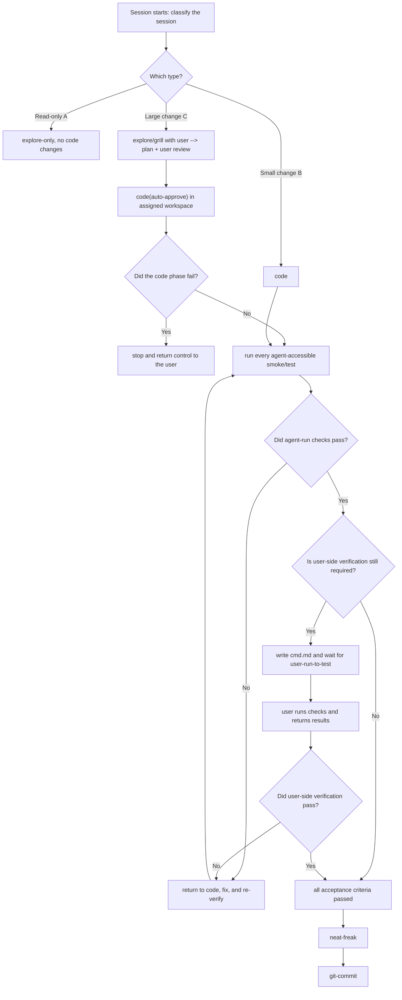

<!-- init-repo-agents:template-meta:begin
  This is the baseline AGENTS.md template generated by init-repo-agents.
  Usage:
  - Replace every {{PLACEHOLDER}} with project-specific facts.
  - Render only the managed block below through scripts/init-repo-agents.sh.
  - Preserve every non-placeholder byte in the managed block.
  - Globally installed skills (neat-freak / karpathy-guidelines / modern-python /
    find-docs and ctx7 / git-commit / gh-cli) can be referenced by name.
  - grill is not installed globally, so its workflow is embedded in Section 2.
  - Fresh AGENTS.md and CLAUDE.md files are byte-identical. Existing file
    suffixes remain independent while their managed blocks stay identical.
init-repo-agents:template-meta:end -->
<!-- init-repo-agents:managed:begin -->

# {{PROJECT_NAME}} · Agent Collaboration Guide

> {{ONE_LINE_PURPOSE}}

**Primary toolchain:** {{PRIMARY_TOOLCHAIN}}

This file defines the behavioral baseline for agents working in this repository. The core principle is: **align before acting, and collaborate instead of making unilateral assumptions.** Clear context alignment with the user is a prerequisite for writing code.

---

## 0. Session Lifecycle (Highest-Level Constraint)

**At the start of every session, the agent must explicitly classify and state the session type** before following the corresponding lifecycle. Do not skip this classification.

**The execution environment is an input to the session.** The current branch, worktree, or other isolated environment is selected by the user or external scheduler before the session starts. The lifecycle below describes one session only. It must not decide how many tasks run in parallel or create or switch workspaces on its own. Unless the user explicitly changes the assignment, stay inside the provided workspace.

- **Type A · Read-only exploration** (`explore-only`): answer questions and investigate without changing code. Gather context in read-only mode and do not enter the coding lifecycle.
- **Type B · Small code change** (`small code`): the change is small, intent is clear, and no major trade-off exists. Skip heavyweight grilling and follow `code → verify → neat-freak → git-commit`.
- **Type C · Large code change** (`large code`): the change is large, architectural, or involves meaningful trade-offs. Follow the full lifecycle, remain in the assigned workspace, and pass the verification gate before wrapping up.



**Type C signals:** irreversible or destructive operations, architectural decisions, or work that must be decomposed into multiple subtasks. When uncertain, classify the session as Type C and align before acting.

**Type C failure handling:** the `code` phase may proceed with auto-approval, but repeated failures or uncertainty about intent require an immediate stop. Return control to the user instead of gambling on another change (see Section 3).

---

## 1. Timing · What to Do When

- **At session start:** determine whether this is a new task or a continuation. For a continuation, read `docs/plan.md` and `docs/log.md` first to recover prior progress and reasoning.
- **Before a Type C task starts:** use the grill workflow in Section 2 to align context and ensure the implementation path matches the user's intent.
- **After candidate code is written:** enter the verification gate below. Implementation is complete at this point; the task is not.
- **After verification passes:** run `neat-freak` at task completion or a milestone to reconcile code, documentation (`docs/`, `README.md`), and memory. Do not spend time synchronizing documentation for code that may not work.
- **After each task passes verification:** prepend an entry to `docs/log.md`. Never record an unverified task as complete.

### Verification Gate (Between Code and Wrap-Up)

1. Before coding, use `karpathy-guidelines` to define observable acceptance criteria. After coding, derive the required checks from those criteria rather than relying on "looks correct."
2. Run an appropriate combination of lint, typecheck, unit tests, and smoke tests wherever the agent can access the required environment. Preserve results that can be reviewed.
3. If acceptance depends on a real robot, VLA setup, dedicated hardware, user credentials, or another environment unavailable to the agent, update the pending-verification section in root `cmd.md` with prerequisites, copyable commands, pass criteria, and the evidence to return on failure. Then stop and wait for the user to run it.
4. Any failed required check returns the task to `code`, followed by the full verification gate again. Do not reuse results invalidated by a fix.
5. Only after every required check passes may the agent run `neat-freak`, record completion in `docs/log.md`, and invoke `git-commit`. During verification, update only the `cmd.md` content required for testing; do not begin broad documentation synchronization.
6. **Commit only the session patch:** stage and commit solely the hunks that implement or document the current session's verified task. Do not include pre-existing changes, unrelated files, drive-by cleanup, or any other work outside the session's scope. Inspect the staged diff before committing; if the intended patch cannot be isolated safely, stop and ask the user.

## 2. Alignment · Prerequisite for Coding (Embedded Grill Workflow)

This is the most important rule. **Never hide uncertainty, rely on guesses, or start implementation while the user's intent is unclear.** Before a Type C change, follow Grill → Distill → Execute. Do not execute until the first two phases are complete.

**Grill**
- Follow the decision tree one question at a time and wait for the answer before asking the next.
- Give a recommended answer and a one-sentence reason with every question.
- Investigate anything that can be answered from code or documentation instead of asking the user.
- When terminology is ambiguous or overloaded, propose one canonical term before continuing (for example: "Does `env` mean the Conda environment or the simulation environment? Choose one.").
- Use concrete scenarios to make unclear relationships or boundaries precise.
- Cross-check the user's description of system behavior against the code and surface contradictions immediately.

**Distill**
- Once discussion converges, write only durable outcomes into this file, then stop for user confirmation. Record only:
  - **Glossary:** canonical terms in the form `term — definition`, without implementation details.
  - **Decisions:** difficult-to-reverse choices in the form `choice · alternatives · rationale`.
- Record a decision only when it is difficult to reverse, surprising without context, and the result of a real trade-off. Skip it unless all three conditions hold.

**Execute**
- Only now write the implementation plan and begin work, following the decisions just recorded.

Follow `karpathy-guidelines`: make the smallest surgical change, avoid speculative design, state assumptions explicitly, and define verifiable success criteria.

## 3. Exceptions · Know When to Stop

When the available context is insufficient for a sound decision, **stop and return control to the user** instead of guessing.

Signals that the agent is stuck include repeating the same failed action, uncertainty about the user's actual intent, approaching an irreversible or destructive operation, or making no progress after multiple attempts.

## 4. Collaboration · Finding Context When a Problem Is Not Immediately Solvable

An agent does not inherently know the details of a specific codebase. When a problem cannot be solved directly, find enough relevant context in this order:

1. **Documentation details** → use `ctx7` / `find-docs` for current library, framework, and API documentation, even for familiar technology.
2. **Unusual bugs** → search online and use `gh` (`gh-cli`) to inspect relevant repository issues.
3. **Still unclear** → ask the user for missing context or stop and return the decision to them.

Base decisions on evidence rather than guesses.

## 5. Documentation · `docs/` Is Shared Project Context

Do not rely excessively on Git history. Maintain readable project context in `docs/` so future sessions can resume quickly and the project can move across machines and agents without depending on CLI-specific global memory. Maintain:

- `docs/plan.md` — the forward-looking plan shared by the user and agent.
- `docs/log.md` — verified completed tasks, with the newest entry first.
- `docs/bug.md` — reusable lessons about unusual bugs, including triggers, fixes, and causes.
- `docs/<module>.md` — module-level responsibilities and boundaries, indexed below.

### Code Documentation Index

Fill module documentation **incrementally**. Create `docs/<module>.md` the first time a module is explored deeply; afterward, read the documentation first to avoid repeatedly rediscovering the code.

<!-- init-repo-agents:module-index:begin -->
{{MODULE_INDEX}}
<!-- init-repo-agents:module-index:end -->
<!-- Seeded from a shallow structural scan during initialization, for example:
- [[docs/datasets.md]] — dataset loading and metadata (`src/<pkg>/datasets/`)
- [[docs/policies.md]] — policy models (`src/<pkg>/policies/`)
Keep unwritten entries as placeholders and fill them when the module is explored. -->

## 6. Command Interfaces · Reduce Manual Command Entry

Consolidate common development commands and complex experiment configuration behind reusable interfaces so neither the user nor the agent must repeatedly reconstruct long commands.

### 6.1 `dev.sh` · Unified Project Entry Point

- **`{{ENTRY_POINT}}` (conventionally `dev.sh`)** wraps common development and launch commands: environment setup, lint, format, typecheck, tests, training, inference, evaluation, and data processing. Expose them as subcommands such as `./dev.sh train`, `./dev.sh eval`, and `./dev.sh lint`.
- When a workflow becomes common, add a `dev.sh` subcommand instead of asking the user to remember a raw command.
- Keep `dev.sh` focused on orchestration: compose commands, load configuration, and pass arguments while implementation remains in the appropriate scripts or entry points.

### 6.2 Complex Parameters · YAML-Driven Experiments

- Put complex experiment parameters in YAML files such as `experiments/<exp_name>.yaml` instead of long command lines. Each experiment file is a complete reproducible configuration.
- Let `dev.sh` options override YAML values, for example: `./dev.sh train --config experiments/foo.yaml --override lr=1e-4`. Baselines remain in YAML while temporary tuning uses options.
- This keeps experiments reproducible, reduces tuning overhead, and lets agents inspect and modify experiment configuration directly.

### 6.3 `cmd.md` · Command Reference

- Root `cmd.md` contains copyable commands for the user, including `dev.sh` examples and typical experiment launches.
- When required verification can only be performed by the user, add or update one pending-verification block. Render it in the user-facing documentation language defined in Section 8 and include these semantic fields:

```markdown
## Pending User Verification
- **Status:** Pending
- **Purpose:** <what this change must prove>
- **Prerequisites:** <required device, environment, data, or service>
- **Commands:** `<copyable commands in execution order>`
- **Pass criteria:** <observable and unambiguous success>
- **Return on failure:** <logs, output, screenshots, or device behavior>
```

- When the user returns results, either mark verification as passed or return to code. Delivering commands is not equivalent to passing verification.

## 7. Code Standards

- **Modern Python projects:** follow `modern-python` conventions, including uv, ruff, and ty.
- **Docstrings:** use Google-style docstrings.
- **Comment granularity:** use one short section comment per coherent block when explanation is useful.
- **Comment intent:** explain why the block exists, not what each statement does. Do not write noise such as `# Import modules`.

## 8. Language Conventions

- **Agent-facing repository instructions:** write `AGENTS.md` and its mirrored `CLAUDE.md` in English.
- **Code comments:** write in English.
- **User-facing documentation:** write `docs/`, `README.md`, and `cmd.md` in Chinese.
- **Agent-only material:** write system prompts, internal plans, and internal notes in English.
<!-- init-repo-agents:managed:end -->
